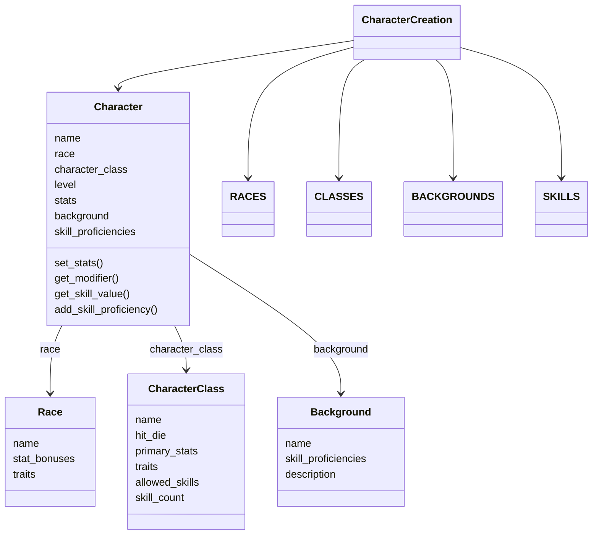
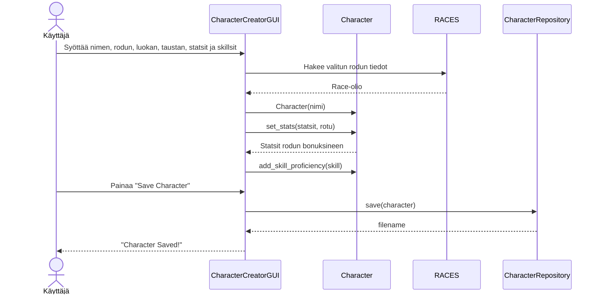

# Arkkitehtuuri

## Rakenne

Ohjelma on jaettu kolmeen pakkaukseen:

- **entities** - sovelluslogiikan luokat
- **tests** - yksikkötestit
- **ui** - käyttöliittymäkoodi

## Sovelluslogiikka

Sovelluksen sovelluslogiikka on jaettu `entities`-pakkaukseen, joka sisältää seuraavat luokat:

- **Character** – vastaa hahmon tiedoista ja laskuista
- **Race** – sisältää rodun tiedot ja stat-bonukset
- **CharacterClass** – sisältää luokan tiedot ja sallitut skillsit
- **Background** – sisältää taustan tiedot ja skill proficiencyt
- **CharacterRepository** – vastaa hahmojen tallennuksesta ja lataamisesta JSON-tiedostoihin

Käyttöliittymä on eriytetty `ui`-pakkaukseen, joka sisältää:

- **CharacterCreatorGUI** – graafinen tkinter-käyttöliittymä
- **CharacterCreation** – tekstipohjainen käyttöliittymä (kehityskäyttöön)

## Luokkakaavio

## Sekvenssikaavio: Hahmon luonti ja tallennus

