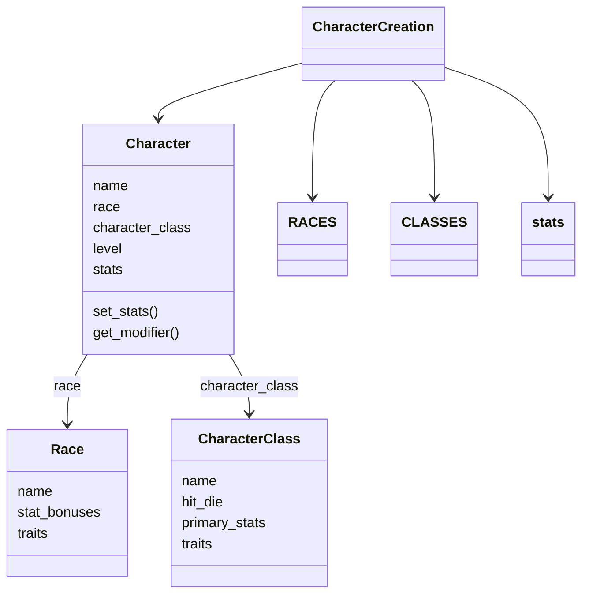

# Arkkitehtuuri

## Rakenne

Ohjelma on jaettu kolmeen pakkaukseen:

- **entities** - sovelluslogiikan luokat
- **tests** - yksikkötestit
- **ui** - käyttöliittymäkoodi

## Luokkakaavio

```mermaid
classDiagram
    CharacterCreation --> Character
    CharacterCreation --> RACES
    CharacterCreation --> CLASSES
    CharacterCreation --> stats
    Character --> Race : race
    Character --> CharacterClass : character_class
    class Character{
        name
        race
        character_class
        level
        stats
        set_stats()
        get_modifier()
    }
    class Race{
        name
        stat_bonuses
        traits
    }
    class CharacterClass{
        name
        hit_die
        primary_stats
        traits
    }
```