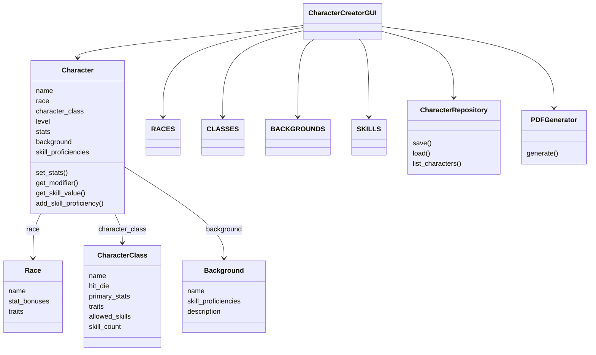
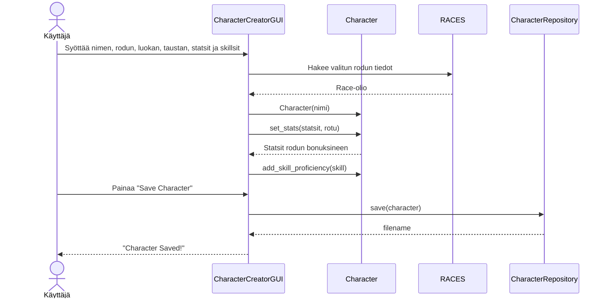

# Arkkitehtuuri

## Rakenne

Ohjelma on jaettu kolmeen pakkaukseen:

- **entities** - sovelluslogiikan luokat
- **tests** - yksikkötestit
- **ui** - käyttöliittymäkoodi

## Sovelluslogiikka

Sovelluksen sovelluslogiikka on jaettu `entities`-pakkaukseen, joka sisältää seuraavat luokat:

- **Character** – vastaa hahmon tiedoista ja laskuista. Sisältää metodit statsien asettamiseen, ability modifier laskentaan ja skill proficiencyjen hallintaan.
- **Race** – sisältää rodun tiedot ja stat-bonukset. Bonukset lisätään automaattisesti hahmon statseihin rodun valinnan yhteydessä.
- **CharacterClass** – sisältää luokan tiedot, sallitut skillsit ja skill valintojen määrän.
- **Background** – sisältää taustan tiedot ja automaattisesti annettavat skill proficiencyt.
- **CharacterRepository** – vastaa hahmojen tallennuksesta ja lataamisesta JSON-tiedostoihin.
- **PDFGenerator** – vastaa hahmon character sheetin generoinnista PDF-muotoon reportlab-kirjaston avulla.

Käyttöliittymä on eriytetty `ui`-pakkaukseen, joka sisältää:

- **CharacterCreatorGUI** – graafinen tkinter-käyttöliittymä hahmon luontiin, lataamiseen ja PDF-exporttiin.

## Tietojen pysyväistallennus

Hahmot tallennetaan JSON-tiedostoihin `saved_characters`-hakemistoon. Jokainen hahmo tallennetaan omaan tiedostoonsa, jonka nimi muodostuu hahmon nimestä. JSON-tiedosto sisältää hahmon kaikki tiedot: nimen, rodun, luokan, taustan, statsit ja skill proficiencyt.

PDF-tiedostot generoidaan samaan `saved_characters`-hakemistoon reportlab-kirjaston avulla.

## Luokkakaavio

## Sekvenssikaavio: Hahmon luonti ja tallennus

