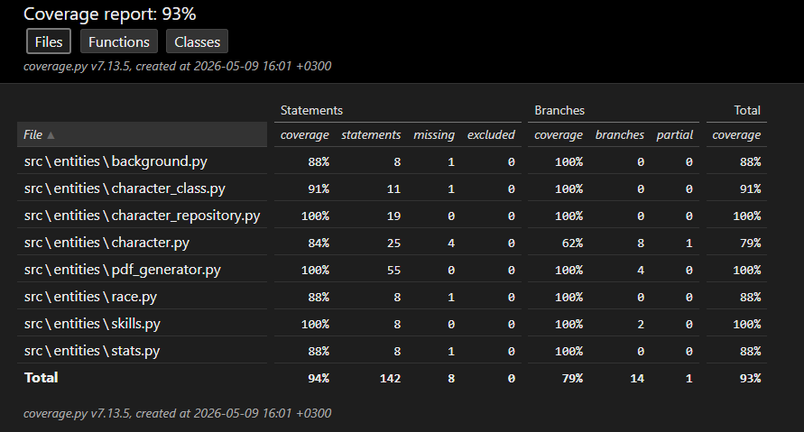

# Testausdokumentti

## Yksikkötestaus

Sovelluksen testaus on toteutettu unittest-sovelluskehyksellä. Testit kattavat sovelluslogiikan luokat `entities`-pakkauksessa.

### Testattavat luokat

**Character**
- Hahmon nimen asettaminen
- Hahmon alkutason tarkistus
- Rodun ja luokan asettaminen
- Statsien asettaminen oikein
- Rodun bonusten soveltaminen statseihin
- Ability modifier laskenta positiiviselle ja negatiiviselle arvolle
- Statsien asettaminen ja skill proficiencyn lisääminen

**Background**
- Taustan skill proficiencyjen tarkistus

**Skills**
- Skill-arvon laskenta ilman proficiencya
- Skill-arvon laskenta proficiencyn kanssa

**Stats**
- 4d6 drop lowest -heiton arvoväli (3-18)

**CharacterClass**
- Luokan skill count tarkistus
- Luokan sallittujen skillien tarkistus

**CharacterRepository**
- Hahmon tallentaminen luo tiedoston
- Tallennetun tiedoston sisältö on oikein
- Hahmon lataaminen palauttaa oikeat tiedot
- Tallennettujen hahmojen listaaminen

## Testikattavuus

Testikattavuusraportti generoidaan komennolla:

```
poetry run invoke coverage-report
´´´

Käyttöliittymäkoodi (`src/ui/`) ja `src/index.py` on jätetty testikattavuuden ulkopuolelle, koska käyttöliittymää ei yksikkötestatata.

Tämänhetkinen testikattavuus on **89%**.



## Järjestelmätestaus

Sovellusta on testattu manuaalisesti Windows-ympäristöstä käsin. Testaus on kattanut seuraavat skenaariot:

- Uuden hahmon luonti kaikilla roduilla, luokilla ja taustoilla
- Statsien asettaminen sekä Standard Array- että nopanheitto-metodilla
- Virheellisten syötteiden antaminen (väärät numerot, tyhjät kentät)
- Hahmon tallennus JSON-tiedostoon
- Tallennetun hahmon lataaminen
- PDF-tiedoston generointi

## Tunnettuja ongelmia

- Sovellusta ei ole testattu Linux-ympäristössä
- PDF-tiedoston ulkoasu on yksinkertainen
- Tekstipohjainen käyttöliittymä (`character_creation.py`) on jäänyt kehityskäyttöön eikä ole enää aktiivisessa käytössä